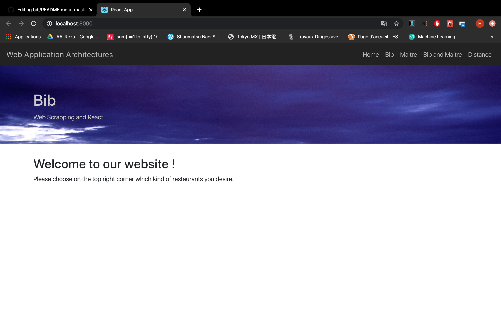
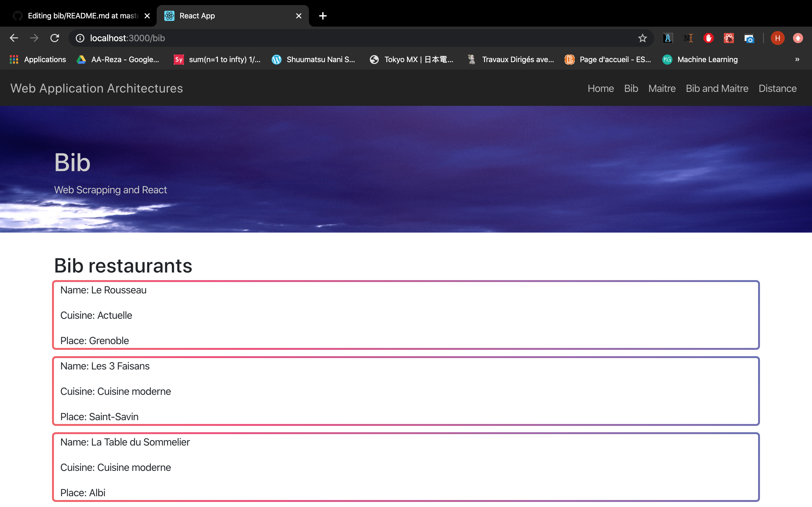
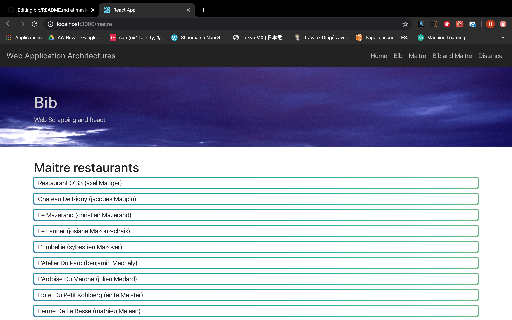
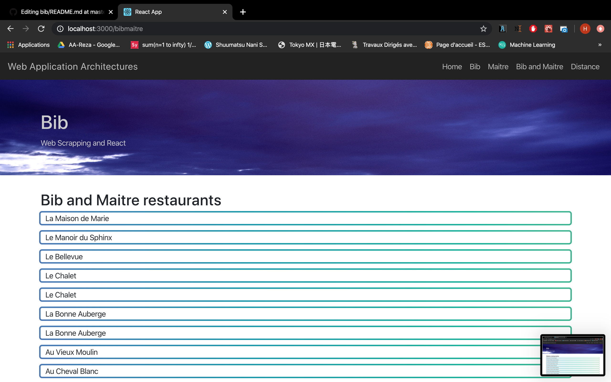
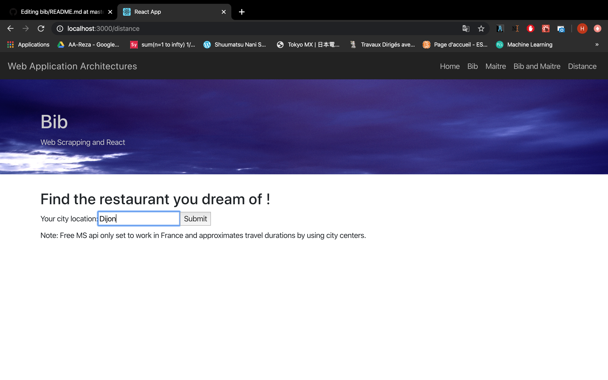
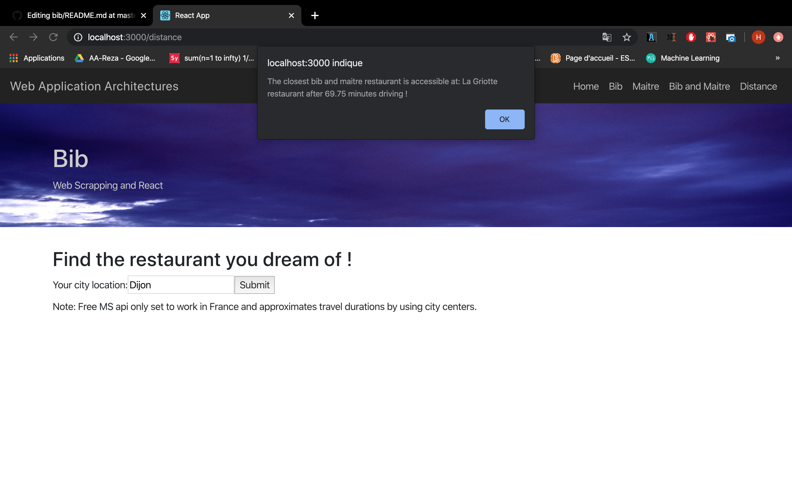

# BIB

The project is divided into two parts:

## Scraping
The first one is the data scrapping part and we will quickly show you how to use it. We scrap data for restaurants from the guide michelin and maitre restaurant websites. We thus have two different files which gives the basic functions to get our datas.

Here are both codes:

michelin.js

```javascript
const axios = require("axios");
const cheerio = require("cheerio");

//Results of scraping is kept here:
var res = [];

const parse = data => {
  const $ = cheerio.load(data);

  //Names
  var item = [];
  //Cuisines
  var item2 = [];
  //Places
  var item3 = [];
  //Used to check if something has been found.
  var check = "";

  //Scrap names
  $(".card__menu-image a").each((i, element) => {
    item.push(
      $(element)
        .attr("aria-label")
        .substring(5)
    );
    check = $(element)
      .attr("aria-label")
      .substring(5);
  });
  //Scrap cuisines
  $(".card__menu-footer--price").each((i, element) => {
    item2.push(
      $(element)
        .text()
        .trim()
    );
  });
  //Scrap places
  $(".card__menu-footer--location").each((i, element) => {
    item3.push(
      $(element)
        .text()
        .trim()
    );
  });
  //Construct our JSON result
  for (var index = 0; index < item.length; index++) {
    res.push({ Name: item[index], Cuisine: item2[index], Place: item3[index] });
  }

  //return { res };

  return check;
};

module.exports.scrapeRestaurant = async url => {
  var info = "";
  var page_nb = 1;
  do {
    console.log("Searching bib page: " + page_nb);
    url = "https://guide.michelin.com/fr/fr/restaurants/bib-gourmand/page/";
    url = url + `${page_nb}`;
    const response = await axios(url);
    const { data, status } = response;
    if (status >= 200 && status < 300) {
      info = parse(data);
    }
    page_nb = page_nb + 1;
  } while (info != "");

  if (res != null) {
    return { res };
  }

  console.error(status);

  return null;
};

module.exports.get = () => {
  return [];
};
```

And thus, michelin.js gives you a way to returns a result with this form (sample):

```json
[
  { "Name": "Le Rousseau", "Cuisine": "Actuelle", "Place": "Grenoble" },
  {
    "Name": "Les 3 Faisans",
    "Cuisine": "Cuisine moderne",
    "Place": "Saint-Savin"
  },
  {
    "Name": "La Table du Sommelier",
    "Cuisine": "Cuisine moderne",
    "Place": "Albi"
  },
  {
    "Name": "Au Bouchon Breton",
    "Cuisine": "Cuisine traditionnelle",
    "Place": "Dinard"
  }
 ]
```

maitre.js

```javascript
const axios = require("axios");
const cheerio = require("cheerio");
//To correct most of String conversions.
var iconv = require("iconv-lite");

var res = [];

const parse = data => {
  var processed_data = iconv.decode(data, "windows-1252");

  var item = [];
  var item2 = [];
  var check = "";

  const $ = cheerio.load(processed_data);

  $(".single_libel a").each((i, element) => {
    item.push(
      $(element)
        .text()
        .trim()
        .replace(/(\B)[^ ]*/g, match => match.toLowerCase())
        .replace(/^[^ ]/g, match => match.toUpperCase())
    );
    check = $(element)
      .text()
      .trim()
      .replace(/(\B)[^ ]*/g, match => match.toLowerCase())
      .replace(/^[^ ]/g, match => match.toUpperCase());
  });

  /*
    var doc = new dom().parseFromString(data)
    var title = xpath.select('//*[@id="zoneAnnuaire_layout"]/div[3]/div[2]/div[3]/div[1]/div[2]/div[2]/div/div[1]/div', doc).toString()
    console.log(title)
    */

  for (var index = 0; index < item.length; index++) {
    res.push({ Name: item[index] });
  }

  for (var index2 = 0; index2 < item2.length; index2++) {
    res.push({ Adresse: item2[index2] });
  }
  //return { res };
  return check;
};

async function get_restaurants_by_page(page_nb) {
  var string_nb = String(page_nb);
  const result = await axios({
    method: "post",
    url: "https://www.maitresrestaurateurs.fr/annuaire/ajax/loadresult#",
    headers: { "content-type": "application/x-www-form-urlencoded" },
    data:
      "page=" +
      string_nb +
      "&sort=undefined&request_id=ec830a0fb20e71279f65cd4fad4cb137&annuaire_mode=standard"
  });
  return result;
}

module.exports.scrapeRestaurant = async url => {
  var info = "";
  var page_nb = 1;
  do {
    console.log("Searching maitre page: " + page_nb);
    const response = await get_restaurants_by_page(page_nb);
    const { data, status } = response;
    if (status >= 200 && status < 300) {
      info = parse(data);
    }
    page_nb = page_nb + 1;
  } while (info != "");

  if (res != null) {
    return { res };
  }

  console.error(status);

  return null;
};

/**
 * Get all France located Maitre restaurants
 * @return {Array} restaurants
 */
module.exports.get = () => {
  return [];
};

```

maitre.js works similarly but instead of a get, it uses a post request. Both are built so that when parsing is done, it allows the script to know when a parsing result is null thus stopping the scrapping if reaching an empty page. This allows us to avoid entering raw values to check website pages.

Note: we need here to do a little character conversion to avoid ASCII like characters, using iconv-lite library on top of our parsing.

Here is a sample result with just the names needed because when we then compare the result of both searching, all we need was already scrapped when getting bib restaurants:

```json
[
  { "Name": "Le Temps D'M (mathias )" },
  { "Name": "Brasserie La Choulette (alain Dhaussy)" },
  {
    "Name": "Scev Lequart Et Fils  Champagne Laurent Lequart (laurent Lequart)"
  },
  { "Name": "Domaine de la Jobeline (pierre Maillet)" },
  { "Name": "Les Pyrenees (patrick Abadie)" }
]
```
Comparison is done using the comparison.js script and it returns matching results between both .json files. It then saves in a .json file our results.

How to use the scraping part:

1)

Place yourself inside your bib folder.

2)
Use the following command to scrap datas from both websites:

```bash
$ node ./server/sandbox.js
```

3)
And finally use the following command to do the comparison.

```bash
$ node ./server/comparison.js
```

## React
How to use the react:

1)
Starting from your bib folder, go to the react_bootstrap one:
```bash
$ cd ./react_bootstrap
```

2)
Please install everything found inside package.json to make the app work.
Then start your web application using the following command line:
```bash
$ yarn start
```

Here is what you'll see:

Home page:


Bib restaurants:


Maitre restaurants:


Filtering with both:


Nearest restaurant page:


Example with your localization at dijon:


Note: I generated the localisation (longitude/latitude) of all my scrapping results with BingMap.js script and copied/pasted the raw data inside my Distance.js file as I had some issues with manipulating it from another file in coordination with react. So only your localisation is fetched from microsoft map api each time you make a request with the city you're located at and also the distance between your city and all raw coordinates copied in the Distance.js file. Results are then compared and the page displays the best result.

Here are a some .js file to show how I build my react app:

Page structure:
```javascript
import React, { Component } from "react";
import { BrowserRouter as Router, Route, Switch } from "react-router-dom";
import { Home } from "./Home";
import { Bib } from "./Bib";
import { Maitre } from "./Maitre";
import { BibMaitre } from "./BibMaitre";
import { Distance } from "./Distance";
import { MyForm } from "./Distance";
import { NoMatch } from "./NoMatch";
import { Layout } from "./components/Layout";
import { NavigationBar } from "./components/NavigationBar";
import { Jumbotron } from "./components/Jumbotron";

class App extends Component {
  render() {
    return (
      <React.Fragment>
        <NavigationBar></NavigationBar>
        <Jumbotron></Jumbotron>
        <Layout>
          <Router>
            <Switch>
              <Route exact path="/" component={Home} />
              <Route path="/bib" component={Bib} />
              <Route path="/maitre" component={Maitre} />
              <Route path="/bibmaitre" component={BibMaitre} />
              <Route path="/distance" component={MyForm} />
              <Route component={NoMatch} />
            </Switch>
          </Router>
        </Layout>
      </React.Fragment>
    );
  }
}

export default App;

```

Component (bib results) exemple:
```javascript
import React from 'react'
import BibRes from './assets/bib_res.json';
import './GradientBorder.css';

//Note: Act like a return.
export const Bib = () => (
        <div>
            <h2>Bib restaurants</h2>
            {BibRes.map((Bib, Name) => {
                return <div className='gradient-border'>
                            <p>Name: {Bib.Name}</p>
                            <p>Cuisine: {Bib.Cuisine}</p>
                            <p>Place: {Bib.Lieu}</p>
                        </div>})}
        </div>
)

```

Layout:
```javascript
import React from 'react';
import { Container } from 'react-bootstrap';

export const Layout = (props) => (
    <Container>
        {props.children}
    </Container>
)
```

Navigation bar:
```javascript
import React from 'react';
import {Nav, Navbar} from 'react-bootstrap';
import styled from 'styled-components';

const Styles = styled.div`
    .navbar{
        background-color: #222;
    }

    .navbar-brand, .navbar-nav .nav-link{
        color: #bbb;

        &:hover{
            color: white;
        }
    }
`;

export const NavigationBar = () =>(
    <Styles>
        <Navbar expand="lg">
            <Navbar.Brand href='/'>Web Application Architectures</Navbar.Brand>
            <Navbar.Toggle aria-controls="basic-navbar-nav"></Navbar.Toggle>
            <Navbar.Collapse id="basic-navbar-nav">
                <Nav className="ml-auto">
                    <Nav.Item><Nav.Link href="/">Home</Nav.Link></Nav.Item>
                    <Nav.Item><Nav.Link href="/bib">Bib</Nav.Link></Nav.Item>
                    <Nav.Item><Nav.Link href="/maitre">Maitre</Nav.Link></Nav.Item>
                    <Nav.Item><Nav.Link href="/bibmaitre">Bib and Maitre</Nav.Link></Nav.Item>
                    <Nav.Item><Nav.Link href="/distance">Distance</Nav.Link></Nav.Item>
                </Nav>
            </Navbar.Collapse>
        </Navbar>
    </Styles>
)
```

Layout:
```javascript
import React from 'react';
import {Jumbotron as Jumbo, Container} from 'react-bootstrap';
import styled from 'styled-components';
import ParisCity from '../assets/Paris.jpg';

const Styles = styled.div`
    .jumbo{
        background: url(${ParisCity}) no-repeat fixed bottom;
        background-size: cover;
        color: #ccc;
        height: 200px;
        position: relative;
         z-index = -2;
    }

    .overlay{
        background-color: #000;
        opacity: 0.6;
        position: absolute;
        top: 0;
        left: 0;
        bottom: 0;
        right: 0;
        z-index: -1;
    }
`;

//fluid is to tell the Jumbotron to occupy the entire horizontal space.
export const Jumbotron = () => (
    <Styles>
        <Jumbo fluid className="jumbo"> 
            <div className="overlay"></div>
            <Container>
                <h1>Bib</h1>
                <p>Web Scrapping and React</p>
            </Container>
        </Jumbo>
    </Styles>
)
```

Distance page (with a partial extract from my .json data I copied to not make this example too long):
```javascript
import React, { Component } from "react";
import "./GradientBorder.css";
import "./App.css";
const axios = require("axios");

async function get_coordinates(city) {
  var link =
    "http://dev.virtualearth.net/REST/v1/Locations/FR/" +
    `${city}` +
    "?&key=AorwfLV2yU2yLl5lbqedx5uijiss74Gz2Ng1196vCiElPM24qfdLbrjbIe8ra8Gh";
  const result = await axios.get(link);
  return result.data;
}

async function get_distance(laO, loO) {
  const result = await axios({
    method: "POST",
    url:
      "https://dev.virtualearth.net/REST/v1/Routes/DistanceMatrix?key=AorwfLV2yU2yLl5lbqedx5uijiss74Gz2Ng1196vCiElPM24qfdLbrjbIe8ra8Gh",
    headers: {
      "Content-Length": 450,
      Accept: "application/json",
      "Content-Type": "application/json"
    },
    data: {
      origins: [
        {
          latitude: laO,
          longitude: loO
        }
      ],
      destinations: dest,
      travelMode: "driving"
    }
  });
  return result.data;
}
/*
var best_res = get_distance(latitude, longitude).then(value2 => {
    alert(value2);
  });
  */

export class MyForm extends React.Component {
  constructor(props) {
    super(props);
    this.state = { value: "" };

    this.handleChange = this.handleChange.bind(this);
    this.handleSubmit = this.handleSubmit.bind(this);
  }

  handleChange(event) {
    this.setState({ value: event.target.value });
  }

  handleSubmit(event) {
    var latitude = 0;
    var longitude = 0;
    var coordinates = get_coordinates(this.state.value).then(value => {
      latitude = value.resourceSets[0].resources[0].point.coordinates[0];
      longitude = value.resourceSets[0].resources[0].point.coordinates[1];

      var best_res = get_distance(latitude, longitude).then(value2 => {
        console.log(JSON.stringify(value2));
        var minimum = 100000;
        var position = -1;
        for (
          var time_value = 0;
          time_value < value2.resourceSets[0].resources[0].results.length;
          time_value++
        ) {
          if (
            minimum >
              value2.resourceSets[0].resources[0].results[time_value]
                .travelDuration &&
            value2.resourceSets[0].resources[0].results[time_value]
              .travelDuration != -1
          ) {
            minimum =
              value2.resourceSets[0].resources[0].results[time_value]
                .travelDuration;
            position = time_value;
          }
        }
        alert(
          "The closest bib and maitre restaurant is accessible at: " +
            dest_names[position]["Name"] +
            " restaurant after " +
            value2.resourceSets[0].resources[0].results[position]
              .travelDuration +
            " minutes driving !"
        );
      });
    });

    event.preventDefault();
  }

  render() {
    return (
      <div>
        <h2>Find the restaurant you dream of !</h2>
        <form onSubmit={this.handleSubmit}>
          <label>
            Your city location:
            <input
              type="text"
              value={this.state.value}
              onChange={this.handleChange}
            />
          </label>
          <input type="submit" value="Submit" />
        </form>
        <p>
          Note: Free MS api only set to work in France and approximates travel
          durations by using city centers.
        </p>
      </div>
    );
  }
}

var dest = [
  { latitude: 48.81407165527344, longitude: -3.443769931793213 },
  { latitude: 48.81407165527344, longitude: -3.443769931793213 }
];

var dest_names = [
  {
    Name: "La Maison de Marie",
    Latitude: 48.81407165527344,
    Longitude: -3.443769931793213
  },
  {
    Name: "Le Manoir du Sphinx",
    Latitude: 48.81407165527344,
    Longitude: -3.443769931793213
  }
];
```
